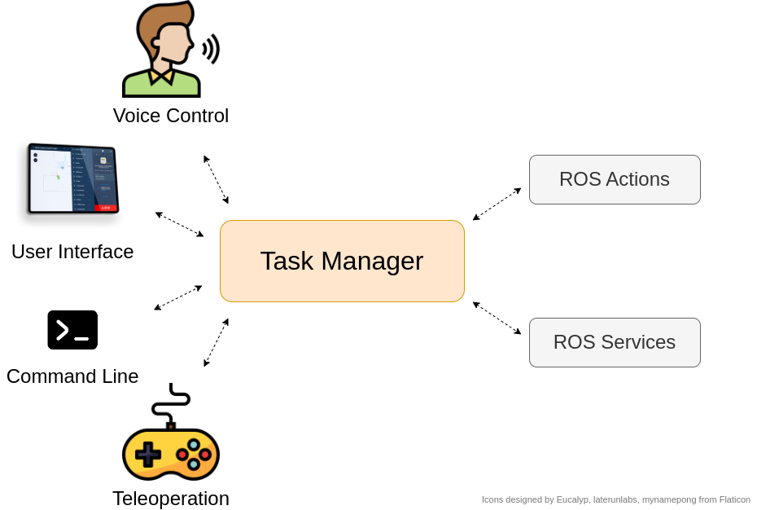
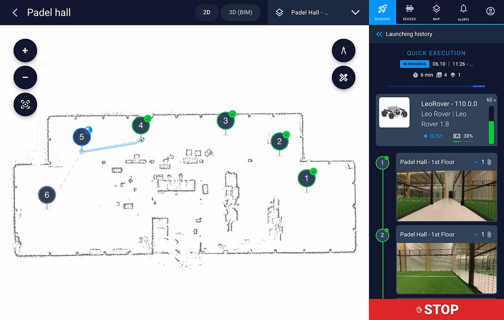

# ROS 2 Task Manager

Task Manager ROS 2 package is a solution to start, handle and track tasks from multiple different sources in a centralized way on a single robot. If you want to:
- have an easy way to start new tasks from any local or web source: UI, voice control, command line, etc.
- track all the currently active tasks and their end results on your robot,
- automatically cancel the previous task if a new conflicting one is given,
- combine multiple smaller tasks into a Mission,
- implement custom behavior for example on task start and end,

Task Manager is your solution!


<p align="center">

</p>


## Features
1. [Tasks](#tasks)
2. [Active tasks](#active-tasks)
3. [Result tracking](#result-tracking)
4. [Missions](#missions)
5. [Task Cancelling](#task-cancelling)
6. [Global STOP-task](#stop)


### Tasks <a name="tasks"></a>
Any existing ROS 2 service or action can be declared as a "Task" in a parameter file. In addition to default service and action features, tasks have the following properties:
-  **Blocking tasks**: Any task can be marked as a blocking task. Only a single blocking task can be active at a time in the whole system, and if another blocking task request is received, Task Manager will cancel the previous blocking task automatically. For example, tasks `navigate_to_pose` and `change_map` should never be active at the same time.
-  **Cancel-on-stop**: Tasks can be cancelled automatically when the global "STOP" task is called.
-  **Single-goal or reentrant execution**: Task can be executed in two different modes:
   - Single-goal behavior (default): Only one task of the same type can be active at once, and a new task request of same type will cancel the previous one.
   - Reentrant: Task runs in parallel with any new coming requests for the same task.
- **Cancel reported as success**: For some continuous tasks, such as `record_video`, user might want to stop the task execution by cancelling it but still report the end status as `DONE`.

For each task request, there are two useful fields:
- **Task ID**: Unique identifier for the task. Auto-generated if left empty.
- **Task Source**: The source of the task. For example "CLOUD", "Voice control", "CLI".

To start a task, send a goal to the action server `/task_manager/execute_task`. For example
```
ros2 action send_goal /task_manager/execute_task task_manager_msgs/action/ExecuteTask '{task_name: system/cancel_task, source: CLI, task_data: "{\"cancelled_tasks\": [\"example_task_id\"]}"}'
```
Note that the `task_data` is the json-formatted version of the action or service message interface.

Tasks provide their end status with the `task_status` field in the result using [TaskStatus](https://github.com/Karelics/task_manager/blob/main/task_manager_msgs/msg/TaskStatus.msg) enumeration.

### Active tasks list <a name="active-tasks"></a>
It is possible to track all the currently active tasks that have their status as `IN_PROGRESS` by subscribing to `/task_manager/active_tasks` topic. The task's end status is also published to this topic just before the task is removed from the list.

Active tasks list can be useful for example to:
- display all the currently active tasks on the robot in the UI,
- track task starts and ends to execute some custom logic, for example to record rosbags automatically during tasks or to display visual and sound effects on the robot.

### Result tracking <a name="result-tracking"></a>
Results for all the tasks are published to `/task_manager/results` topic. This makes it very easy to send the results forward for example to the Cloud or UI, no matter where the task was started from. Task results are always json-formatted.

Note that the task's result can be an empty json `"{}"` if there was an error during task parsing.

### Missions <a name="missions"></a>

Task Manager provides a way to combine multiple tasks into a larger Mission. This can be useful when implementing features such as Photo Documentation, which combines multiple smaller `navigation` and `take_photo` tasks.

- Mission is just another task that will be active in addition to its subtasks.
- All the subtasks will execute as independent tasks: Their results are published in the same way to `/task_manager/results` as for normal tasks.
- Mission reports all the subtask statuses in the mission result. Subtask results are not published here.

Mission can be started by calling `system/mission` task.

<p align="center">

</p>

### Task Cancelling <a name="task-cancelling"></a>
Tasks can be cancelled by calling a `system/cancel_tasks` task with the Task IDs that should be cancelled. This provides an easy way to cancel any executing task, no matter which ROS Node started it.

Tasks that are implemented using ROS Services cannot be cancelled due to their nature. Trying to cancel such a task will make Task Manager wait for a predefined time for the task to finish and return an `ERROR` status if it doesn't.

### Global STOP-task <a name="stop"></a>
Task manager provides a `system/stop` task, which can be called to stop all the active tasks that have their parameter `cancel_on_stop` set to `True`.

## Public API

### Published topics
| Topic                      | Description                                                                                                                                       | Message interface                                                                                               |
|----------------------------|---------------------------------------------------------------------------------------------------------------------------------------------------|-----------------------------------------------------------------------------------------------------------------|
| /task_manager/active_tasks | Publishes all the tasks that are currently in progress. Reports also the task's final completion status before the task is removed from the list. | [ActiveTaskArray](https://github.com/Karelics/task_manager/blob/main/task_manager_msgs/msg/ActiveTaskArray.msg) |
| /task_manager/results      | Publishes the end results of all the tasks.                                                                                                       | [TaskDoneResult](https://github.com/Karelics/task_manager/blob/main/task_manager_msgs/msg/TaskDoneResult.msg)   |

### Actions
| Action topic               | Description                      | Message interface |
|----------------------------|----------------------------------|-------------------|
| /task_manager/execute_task | Starts any task with given data. | [ExecuteTask](https://github.com/Karelics/task_manager/blob/main/task_manager_msgs/action/ExecuteTask.action)       |

## Available tasks

The following tasks are available by default from the Task Manager

| Task name          | Description                                                                      | Message interface                                                                                       |
|--------------------|----------------------------------------------------------------------------------|---------------------------------------------------------------------------------------------------------|
| system/mission     | Starts a mission.                                                                | [Mission](https://github.com/Karelics/task_manager/blob/main/task_manager_msgs/action/Mission.action)   |
| system/cancel_task | Cancels the given tasks by Task ID.                                              | [CancelTasks](https://github.com/Karelics/task_manager/blob/main/task_manager_msgs/srv/CancelTasks.srv) |
| system/stop        | Cancels all the active tasks that have `cancel_on_stop` parameter set to `True`. | [StopTasks](https://github.com/Karelics/task_manager/blob/main/task_manager_msgs/srv/StopTasks.srv)     |

## Parameters

| Parameter                     | Type     | Default | Description                                                                                                                                                                                                                                                                                                                                                                                                                       |
|-------------------------------|----------|---------|-----------------------------------------------------------------------------------------------------------------------------------------------------------------------------------------------------------------------------------------------------------------------------------------------------------------------------------------------------------------------------------------------------------------------------------|
| tasks                         | string[] | -       | List of tasks.                                                                                                                                                                                                                                                                                                                                                                                                                    |
| \<task>.task_name             | string   | -       | Name of the task. Defines the task type identifier to use when starting tasks via ExecuteTask action, i.e. the value of task field in the goal needs to match this task name.                                                                                                                                                                                                                                                     |
| \<task>.topic                 | string   | -       | Topic of the already existing service or action that implements the task logic.                                                                                                                                                                                                                                                                                                                                                   |
| \<task>.msg_interface         | string   | -       | The message interface of the existing service or action, for example `"example_interfaces.action.Fibonacci"`.                                                                                                                                                                                                                                                                                                                     |
| \<task>.blocking              | bool     | False   | Whether the task is blocking or not. Only one blocking task can be active at once, and any newly given blocking tasks will cancel the previous one.                                                                                                                                                                                                                                                                               |
| \<task>.cancel_on_stop        | bool     | False   | Whether the task should be cancelled when "STOP" task is executed.                                                                                                                                                                                                                                                                                                                                                                |
| \<task>.reentrant             | bool     | False   | Allows executing multiple goals for the same task in parallel. Note that the service or action implementing the task logic should also use a reentrant callback group for enabling of this option to make sense.                                                                                                                                                                                                                  |
| \<task>.service_success_field | string   | ""      | A usual way for ROS services is to provide their successful execution status for example with the "success" field in the response message. Specify here the name of this field if you wish your task to automatically set its status to ERROR when this field value is `False`. If left empty, the task will always finish with DONE status. <br/><br/> Note: Works only for the tasks that implement their logic with a service. |

The parameters that have their default as "-" are mandatory.

## Installation
### Docker
Prerequisites:
- Docker and Docker Compose installed in the system

Run in the current repository location:
```
cd docker
docker compose up
```

Verify that everything works correctly by running tests in a separate terminal:
```
docker exec -it task_manager bash
python3 -m pytest /ros2_ws/src/task_manager/test/
```

Create a new parameter file declaring your tasks, and you are ready to launch the Task Manager:
```
ros2 launch task_manager task_manager.launch.py params_file:=/ros2_ws/src/task_manager/params/task_manager_defaults.yaml
```


## Maintainers

Task Manager is maintained by Karelics Oy. Current active maintainers:
- [Janne Karttunen](https://www.linkedin.com/in/janne-karttunen-a22375209/)

